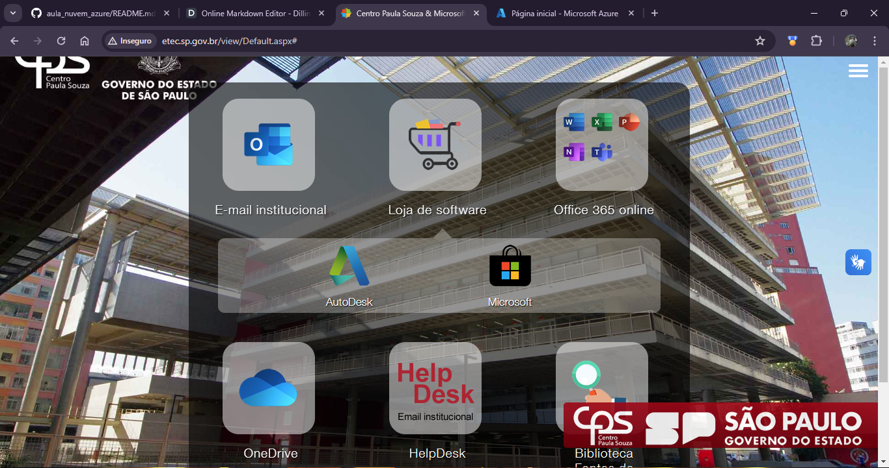
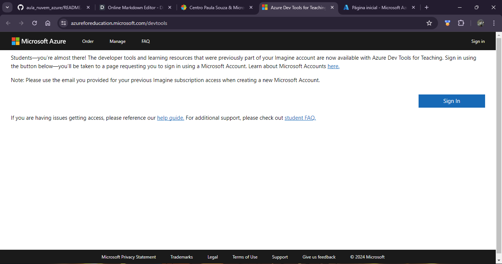

# Guia Prático de Configuração de Maquina Virtual na Azure e implantação de um site

Material montado com o intuio de mostrar um passo a passo de como configurar uma máquina virtual no sistema da Microsoft Azure e implantar um site simples com o servidor web Nginx.

## Dependências

Para seguir esse guia é necessário ter um conhecimento básico de comandos linux, já que a máquina utilizada será feita com base em um Sistema Operacional Ubuntu. Além disso é necessário uma conta de estudante válida com o saldo que a Microsoft provém, porque máquinas virtuais na Azure são um recurso pago, e se não tiver cuidado custoso também.
Abaixo vou listar o que será necessário para realizar o que estiver sendo apresentado neste guia:

- Navegador de Internet atualizado, recomenda-se o **Google Chrome** ou **Microsoft Edge**;
- Sorftware para conexão via SSH, [PuTYY](https://putty.org/);
- Força de vontade e paciência, principalmente.

>OBS: Paciência porque quando mexemos nesse tipo de plataforma podem incorrer problemas durante o caminho, quem está no terceiro módulo ou já mexeu com tecnologia sabe bem o que acontece.

## Acessando a Microsoft Azure

Para acessar a plataforma e conectar com a conta disponibilizada pela ETEC, irão fazer o seguinte:

1. Acessar o site dos recursos da conta institucional [https://etec.sp.gov.br/](https://etec.sp.gov.br/);

2. Clicar em **Loja de Software**;

3. Clicar em **Microsoft**;

4. Em seguida clicar em **Acesso a loja**;

5. No site que o link indicar irá clicar em **Sign In** ou **Acessar**;

6. Conectar com sua **conta da ETEC**;

7. Acessar o **Microsoft Azure**.

> Caso solicite que faça uma verificação de sua conta responder as perguntas com dados válidos, ao final será redirecionado para a plataforma.

## Criando a Máquina Virtual

Para criar a Máquina Virtual na plataforma da Microsoft Azure iremos navegar até a opção referente a ela e seguir alguns passos.

1. Na tela inicial do Azure selecionar a opção de Máquina Virtual:

2. Clicar na opção **Máquinas virtuais** ou **Criar um recurso** e procurar a opção **Máquinas virtuais**;

3. Clicar em **Criar**, em seguida clicar em **Máquina Virtual do Azure**;

4. Na tela que se abrir fazer as seguintes configurações:
    - **Assinatura:** Azure for Students;
    - **Grupo:** Novo;
    - **Nome da máquina virtual:** Escolham um nome;
    - **Região, Opções de disponibilidade e Zona de disponibilidade:** Não alterar;
    - **Tipo de segurança:** Padrão;
    - **Imagem:** Ubuntu Server 22.04 LTS - x64 Gen2;
    - **Arquitetura da VM:** x64;
    - **Executar com desconto de Spot do Azure:** Não selecionar;
    - **Tamanho:** Standart_B1s;
    - **Conta de Administrador**: Marque como senha e informa o nome de usuário e senha para acesso futuro;
    - **Regras de portas de entrada**:
        - **Portas de entrada públicas:** Permitir portas selecionadas;
        - **Selecione as portas de entrada:** Selecionar todas as portas.
    > Outras opções não serão modificadas.

5. Após realizar as alterações, criar a máquina virtual e baixar a chave privada.

## Conectar a máquina virtual via SSH

Após a configuração da máquina virtual e feito o download da chave privada referente ao recurso iremos configurar sua conexão SSH. Para isso iremos utilizar o PuTTY para conectar via SSH a máquina virtual, utilizando uma senha.

1. Com a máquina criada acesse ela através da guia de **Máquinas virtuais**;
2. Selecione a máquinna virtual que acabamos de criar;
3. Clique em **Conectar**, na aba de seleção que exibir clique em **Conectar** novamente;
4. Na janela que se abrir copie o IP público da máquina virtual;
5. Com o IP selecionado abra o **PuTTY**;
6. Na guia **Session** cole o ip na caixa **Host Name (or IP address)**;
7. Em **Port** mantenha a número **22**;
8. Após informar os dados clique em **Open**;
9. Informe o **nome de usuario** configurado na instalação, após a **senha**;
10. Estando tudo correto a conexão será feita e será possível interagir com a máquina virtual através do terminal.

> OBS: Caso prefira pode ser armazenado esses dados de conexão para acesso futuro.

## Configurando o Nginx e subindo um site básico

Após acessarmos a maquina virtual corretamente iremos configurar o sistema, instalando o Nginx, configurando o firewall e subindo um site básico.

1. Através do terminal rode os seguintes comandos:

~~~bash
sudo apt update
sudo apt install nginx
~~~

_Esses comandos irão buscar alterações no servidor e instalar a versão mais atual do pacote informado, no caso o nginx_

2. Após instalar o **ngix** rode o seguinte comando:

~~~bash
sudo ufw app list
~~~

_Esse comando vai verificar que serviços estão disponíveis e podem ser liberados no firewall_

Retornando o seguinte resultado:

~~~bash
Available applications:
  Nginx Full
  Nginx HTTP
  Nginx HTTPS
  OpenSSH
~~~

3. Com o resultado em mão iremos liberar todos os serviços, inclusive o **OpenSSH**. Se não fizermos isso podemos perder o acesso a maquina virtual e teremos que criar uma nova:

~~~bash
sudo ufw allow 'Nginx Full'
sudo ufw allow 'Nginx HTTP'
sudo ufw allow 'Nginx HTTPS'
sudo ufw allow 'OpenSSH'
~~~

4. Após rodarmos os comandos vamos verificar seu resultado com o seguinte comando:

~~~bash
sudo ufw status
~~~

> Caso retorne como: `status: inactive`, execute o seguinte comando: `sudo ufw enable`. **Não rode esse comando se não tiver certeza que liberou o acesso ao OpenSSH**.

5. Após executar os comandos podemos verificar se as alterações funcionaram da seguinte forma:

~~~bash
curl -4 icanhazip.com
~~~

_Esse comando irá retornar o IP público da máquina virtual, com ele podemos digitar no navegador, fora da máquina virtual e se tudo estiver correto irá exibir uma página padrão do Nginx._

6. Com esse resultado agora pode ser criado nosso site em um local específico.

## Criando um site básico

Com o Nginx funcional podemos subir um site de uma forma bem simples, apenas acessando o seguinte local `/var/www/html` e dentro dessa pasta criar meus arquivos, ou puxar o site do GitHub.

> Vale ressaltar que para o Nginx identificar o site é preciso que, na raiz dentro de _html_ exista o arquivo `index.html`, caso não tenha podemos perder as referências do projeto.

## Considerações finais

O guia consiste nessas etapas, será feito acompanhado durante a aula, mas caso tenha dúvidas não hesite em perguntar, a ideia é fazer isso juntos.

---

Prof° Vinícius Lopes, 2024

